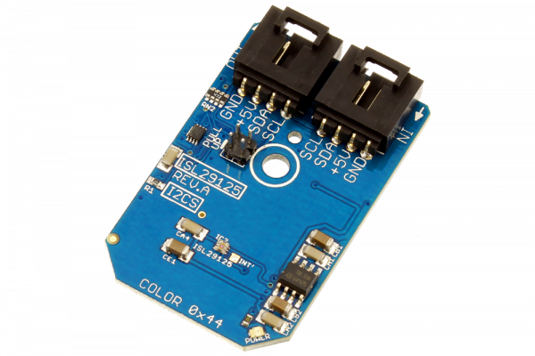

[](https://store.ncd.io/product/isl29125-digital-red-green-blue-color-light-sensor-with-ir-blocking-filter-i2c-mini-module/).

# ISL29125

Intersil’s ISL29125 is a low power, high sensitivity RGB color light sensor with an I2C interface.Its state-of-the-art photodiode array provides an accurate RGB spectral response and excellent light source to light source variation (LS2LS).The ISL29125 is designed to reject IR in light sources allowing the device to operate in sunlight or dark rooms.
This Device is available from www.ncd.io

[SKU: ISL29125]

(https://store.ncd.io/product/isl29125-digital-red-green-blue-color-light-sensor-with-ir-blocking-filter-i2c-mini-module/)
This Sample code can be used with Raspberry Pi.

Hardware needed to interface ISL29125 digital RGB color and light sensor With Raspberry Pi :

1. <a href="https://store.ncd.io/product/isl29125-digital-red-green-blue-color-light-sensor-with-ir-blocking-filter-i2c-mini-module/">ISL29125 digital RGB color and light Sensor</a>

2. <a href="https://store.ncd.io/product/i2c-shield-for-raspberry-pi-3-pi2-with-outward-facing-i2c-port-terminates-over-hdmi-port/">Raspberry Pi I2C Shield</a>

3. <a href="https://store.ncd.io/product/i%C2%B2c-cable/">I2C Cable</a>

## Python

Download and install smbus library on Raspberry pi. Steps to install smbus are provided at:

https://pypi.python.org/pypi/smbus-cffi/0.5.1

Download (or git pull) the code in pi. Run the program.

```cpp
$> python ISL29125.py
```
The lib is a sample library, you will need to calibrate the sensor according to your application requirement.
